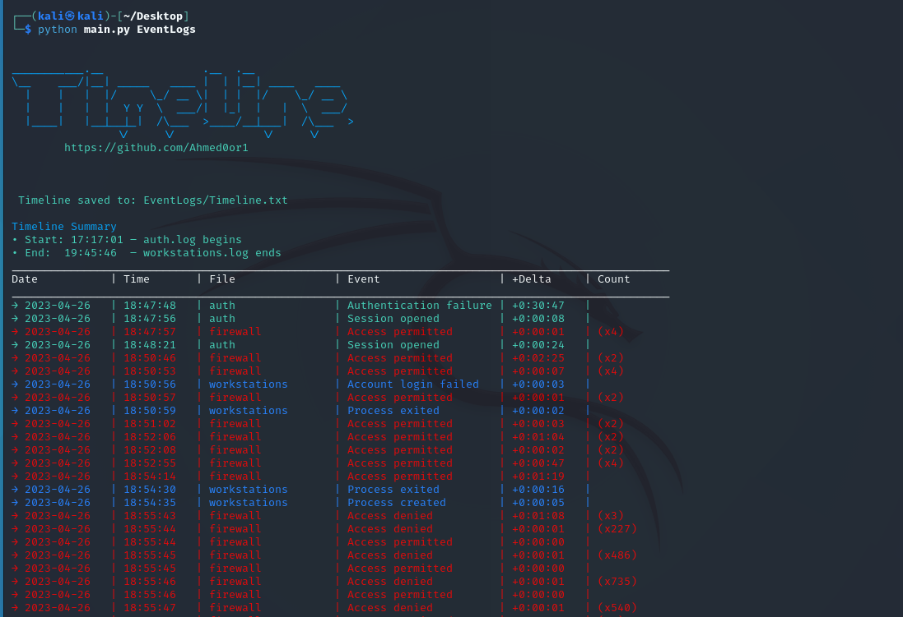

This script parses system log files (auth.log, firewall.log, workstations.log) and generates a clean, color-coded timeline of important security and system events. It is designed for incident response, log analysis, and digital forensics.



## 📊 Output Columns
| Column   | Description                                                     |
|----------|-----------------------------------------------------------------|
| `Date`   | Date of the event (`YYYY-MM-DD`)                                |
| `Time`   | Time of the event (`HH:MM:SS`)                                  |
| `File`   | Source log file name (e.g., `auth`, `firewall`, `workstations`) |
| `Event`  | Short description of the detected activity                      |
| `+Delta` | Time difference from the previous unique event                  |
| `Count`  | Number of repeated events at the same timestamp                 |


## 🎨 Terminal Color Coding
- `auth.log` → Green
- `firewall.log` → Red
- `workstations.log` → Blue
- Table Headers → White

## 🚀 Usage
```bash
python main.py <log_folder_path>
```

### Expected Files Inside `EventLogs`
The script looks for the following log files:
- `auth.log`
- `firewall.log`
- `workstations.log`

**You can include one or more of these files — at least one is required.**  
The script will process only the files that are present.


